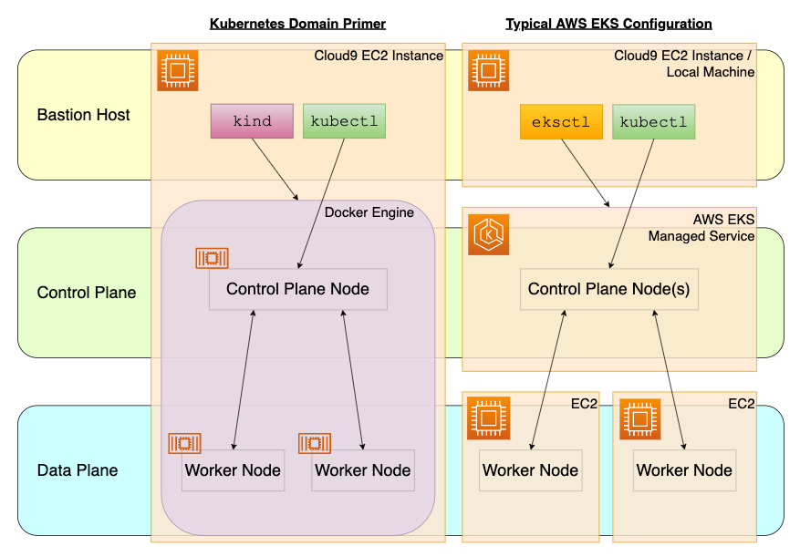

# tips-2022-k8s-demo - "Kubernetes The Fast Way"

Ever want to try out something in Kubernetes, but ...
- you can't be bothered to wait 20 minutes to stand up an EKS cluster?
- you're tired of bouncing your images off registries for no good reason?
- you don't want your precious laptop turning into a big ball of mud?

If so, read on ...

## Step 1 - Create your Cloud9 instance from CloudShell (us-west-2)

Navigate to [https://us-west-2.console.aws.amazon.com/cloudshell/home](https://us-west-2.console.aws.amazon.com/cloudshell/home) then issue the following commands.
```bash
rm -rf /usr/local/bin/aws 2> /dev/null
rm -rf /usr/local/aws-cli 2> /dev/null
rm -rf aws awscliv2.zip 2> /dev/null
curl --silent "https://awscli.amazonaws.com/awscli-exe-linux-x86_64.zip" -o "awscliv2.zip"
unzip awscliv2.zip
sudo ./aws/install --update
subnet_id=$( \
  aws ec2 describe-subnets \
    --filters "Name=availability-zone,Values=${AWS_DEFAULT_REGION}a" "Name=default-for-az,Values=true" \
    --query "Subnets[].SubnetId" \
    --output text \
)
env_id=$(
  aws cloud9 create-environment-ec2 \
    --name tips-$(date +"%Y%m%d%H%M") \
    --instance-type m5.large \
    --image-id amazonlinux-2-x86_64 \
    --subnet-id ${subnet_id} \
    --automatic-stop-time-minutes 1440 \
    --query "environmentId" \
    --output text \
)
echo "Your Cloud9 instance is at https://${AWS_DEFAULT_REGION}.console.aws.amazon.com/cloud9/ide/${env_id}"
```

## Step 2 - Use Cloud9 terminal to expand disk storage

**Navigate to the URL** shown by the previous step then issue the following commands in the Cloud9 terminal.
```bash
df -T # check disk use percentage before (typically ~80%) ...
region=$(curl --silent http://169.254.169.254/latest/meta-data/placement/region)
instance_id=$(curl --silent http://169.254.169.254/latest/meta-data/instance-id)
volume_id=$(aws ec2 describe-instances \
  --region ${region} \
  --instance-id ${instance_id} \
  --query "Reservations[0].Instances[0].BlockDeviceMappings[0].Ebs.VolumeId" \
  --output text
)
aws ec2 modify-volume \
  --region ${region} \
  --volume-id ${volume_id} \
  --size 30
while [ \
  $(aws ec2 describe-volumes-modifications \
    --region ${region} \
    --volume-id ${volume_id} \
    --filters Name=modification-state,Values="optimizing","completed" \
    --query "length(VolumesModifications)" \
    --output text) != 1 ]; do
  sleep 1
done
sudo growpart /dev/nvme0n1 1
sudo xfs_growfs -d /
df -T # ... check disk use percentage has been reduced
```

## Step 3 - Build a single node K8s Cluster (background job)

In a dedicated terminal, stand up a 1 node cluster using KinD (~1 minute)
```bash
curl -Lo ./kind https://kind.sigs.k8s.io/dl/v0.11.1/kind-linux-amd64
chmod +x ./kind
sudo mv ./kind /usr/local/bin/kind
kind create cluster
```

## Step 4 - Create PHP app

```bash
wget https://raw.githubusercontent.com/amcginlay/tips-2022-k8s-demo/main/image.png

cat <<EOF >~/environment/index.php 
<html>
<head><title>TIPS 2022</title></head>
<body>
<?php
  echo "Hello from " . gethostname(). "\n";
?>

</body>
</html>
EOF
```

## Step 5 - Test App on Cloud9

Run the PHP app locally
```bash
php -S localhost:8080
```

Now, in the Cloud9 toolbar, select "Preview" -> "Preview Running Application"

Stop the app.
```bash
ctrl+c
```

## Step 5 - Test App in Docker

Construct the Dockerfile.
```bash
cat <<EOF >~/environment/Dockerfile 
FROM php:8.0.1-apache
COPY index.php image.png /var/www/html/
RUN chmod a+rx index.php
EOF
docker build --tag demo:1.0.0 ~/environment/
container_id_one=$(docker run --detach --rm --publish 8080:80 demo:1.0.0)
docker ps --latest
```

Now, in the Cloud9 toolbar, select "Preview" -> "Preview Running Application"

Stop the app.
```bash
docker stop ${container_id_one}
```

## Step 6 - Load app into KinD

A Kubernetes node typically pulls images from registries in reaction to images being missing from its cache.
With KinD we can circumvent the need for image registries by pre-loading the caches.

Inspect the built image in Docker then load into KinD.
```bash
docker images demo:1.0.0
kind load docker-image demo:1.0.0
```

## Step 7 - Install kubectl

```bash
curl -LO "https://dl.k8s.io/release/$(curl -L -s https://dl.k8s.io/release/stable.txt)/bin/linux/amd64/kubectl"
sudo install -o root -g root -m 0755 kubectl /usr/local/bin/kubectl
rm kubectl*
```

## Step 8 - Launch deployment, expose service and view objects

```bash
kubectl create namespace tips
kubectl -n tips create deployment demo --image demo:1.0.0
kubectl -n tips get pods
```

## Step 9 - Forward port for Cloud9 visibility

Port forwarding provides a neat and secure solution for ad-hoc port mapping.
```bash
kubectl -n tips port-forward deployment/demo 8080:80 # ctrl+c to stop
```

Now, in the Cloud9 toolbar, select "Preview" -> "Preview Running Application"

## Step 10 - discuss KinD versus EKS

Inspect the image shown in the browser

## Step 11 - Restarts

Delete the pod to show how the deployment will resurrect the pod (see AGE)
```bash
kubectl -n tips get pods
kubectl -n tips delete pods --all
kubectl -n tips get pods
```

## Step 11 - Delete cluster

Use the following command to quickly(!) terminate ALL your cluster resources.
```bash
kind delete cluster
```
